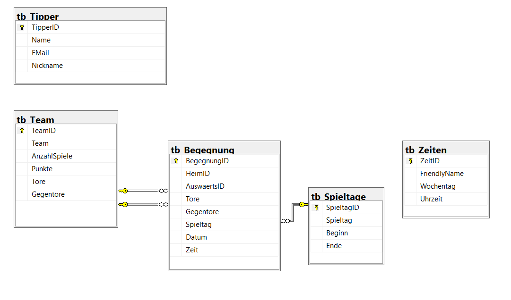

# LigaTipps

Für Fans von SQL und der (1., 2., 3.) Fußball-Bundesliga ⚽⚽.

## Länderspezifika
Es gelten die Regeln der deutschen Fußball-Bundesliga. Die Datenbank ist aber im Wesentlichen kompatibel zu einigen anderen europäischen Ligen mit einem ähnlichen System. Am wichtigsten ist die Punktevergabe: 3 Punkte für Siege, 1 Punkt für Unentschieden, 0 Punkte für Niederlagen.

Siehe auch 

## Datenbankstruktur und Installation
Siehe doc-Verzeichnis, dort ist eine Installationsanleitung.

## Eintragen
Man trägt die für die Spieltage angesetzten Begegnungen ein. 
Das geht mittels der Eingabeprozedur &rightarrow; siehe Beispiel [EintragBegegnung](/sql/snippets/SQL1_EintragBegegnung.sql). 
Später geht das evtl. über eine Art Formularanwendung mit Drop-Down-Auswahlliste... 

Die Sicht "Spieltag" ist mit der rechten Maus auch im Bearbeitungsmodus (Edit) zu öffnen, um rasch die Tore einzutragen, wie ein Spiel ausgegangen ist.
Daraufhin merkt das die Anwendung im Hintergrund und berechnet automatisch die Punkte und gesamt erzielten Tore der beteiligten Mannschaften.

## Sichten
Ansichten der Spieltage und die Ligatabelle 
Wer wissen möchte, auf welchem Platz sein Club gerade steht, erfährt das über die Query_Ligatabelle. 
Diese geordnete Abfrage der Ligatabellansicht zeigt die aktuelle Platzierung nach Punkten und Tordifferenz.
Die Ligatabellansicht selbst ist unsortiert, da SSMS (derzeit) die Sicht nicht mit OrderBy-Klausel speichern kann.

## Tippspiel
Eine Tippfunktion wird es auch geben, steckt momentan in den Anfängen 👩‍💻
